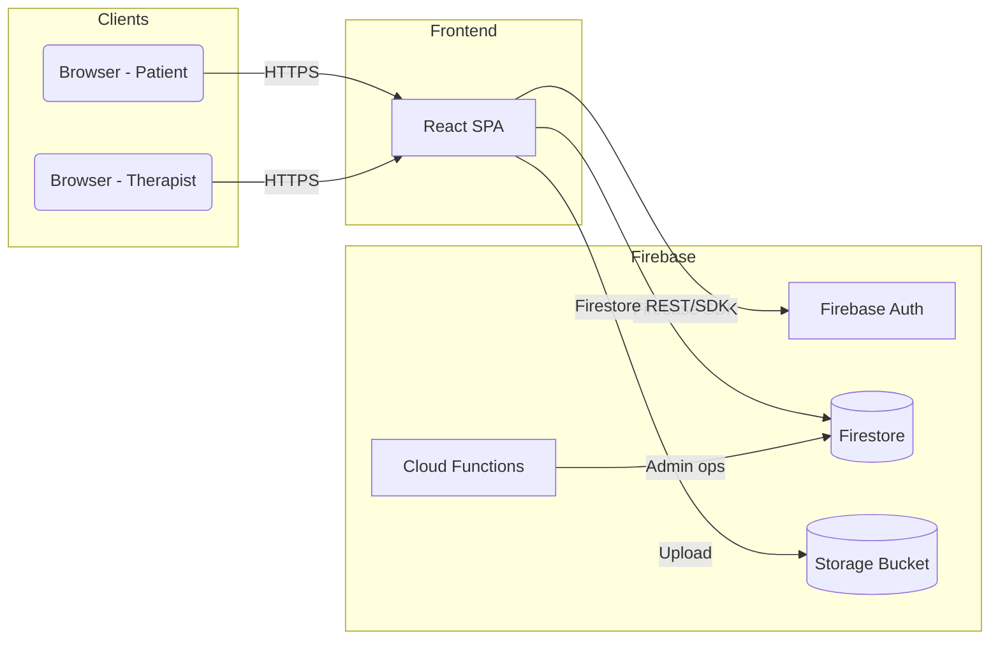
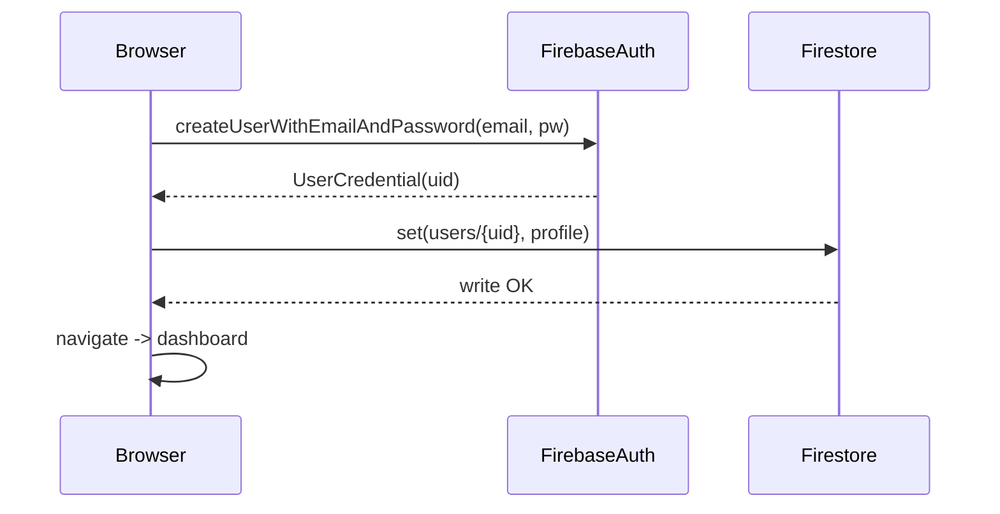

# Generate Complete System Architecture Diagram — Prompt

Purpose
- Produce a complete, production-ready system architecture diagram for the Serien mental-health teleconsultation platform.
- The diagram should include high-level and detailed views, data flows, integration points, security boundaries, and scaling/observability considerations.

Intended audience
- Engineers and architects who will implement, review, and operate the system.
- Product managers and security reviewers who need to understand data movement and compliance boundaries.

Primary goals
1. Capture components and interactions for frontend, backend, authentication, storage, realtime, ML inference, and third-party integrations.
2. Show user flows for the two roles: `patient` and `therapist` (signup, login, schedule/session, messaging, journals, reports, assignments).
3. Provide diagrams in multiple formats: high-level block diagram, container/component diagram, sequence diagrams for critical flows, and optional Mermaid/PlantUML source.
4. Highlight security controls (Firebase Auth, Firestore rules, TLS, CORS, storage rules), compliance notes (HIPAA-relevant boundaries), and operational concerns (scaling, backups, monitoring).

Required components to include
- Frontend
  - `frontend-react` (SPA hosted on Vite / static hosting)
  - Browser clients (desktop/mobile)
  - Optional SDKs (Firebase JS SDK)

- Authentication & Identity
  - Firebase Authentication (Email/Password, Google Sign-in)
  - Identity boundaries and authorized domains

- Backend & APIs
  - `server.js` / `app.py` (if present) or serverless functions
  - REST API endpoints and any WebSocket/Socket server (e.g., `socket.js`)
  - ngrok usage note (dev-only tunneling)

- Database & Storage
  - Firestore collections: `users`, `sessions`, `journals`, `reports`, `assignments`, `responses`, `therapistPatients`
  - Storage bucket for media (images, recordings)
  - Rules and security boundaries (link to `firestore.rules` and `storage.cors.json`)

- Machine Learning
  - On-device or server-side models (models/ facial emotion models, TensorFlow/Keras `.h5` or TFJS weights)
  - Face_Emotion_Recognition pipeline (realtimedetection.py, test_model.py)
  - Model hosting vs local inference tradeoffs

- Third-party services
  - Firebase Console (Auth, Firestore, Storage, Functions, Hosting)
  - Analytics (Firebase Analytics, 3rd party), Email/SMS providers, Google OAuth

- Real-time & Media
  - Video call flow (WebRTC / signaling server) — `VideoCall.jsx` and `socket.js`
  - TURN/STUN considerations

- Dev / CI / Deployment
  - Hosting (Firebase Hosting, Vercel, or custom), CI pipelines, secret management
  - Deployment paths for `firestore.rules` and `firebase.json`

- Observability
  - Logging, metrics, SLOs, error reporting, backups

Views to produce
1. High-level system diagram (single-page overview showing all major components and network boundaries).
2. Container/component diagram (frontend, backend, db, storage, ML, realtime) with arrows for data flow.
3. Sequence diagram(s) for:
   - Signup + profile creation
   - Login + role resolution + dashboard redirect
   - Google Sign-in flow
   - Starting a video call (signaling + NAT traversal)
   - Creating and reading a journal/report flow with therapist permissions
4. Data model excerpt: Firestore collections, key fields, and security rules references.
5. Security and compliance overlay: where PHI/PII resides and how it's protected.

Output formats
- Primary: Mermaid diagrams (block/flow and sequence) with source code included in the response so it can be rendered.
- Secondary: PlantUML or DOT if Mermaid is insufficient.
- Also include a concise text summary and a checklist of acceptance criteria.

Styling & notation
- Use clear rectangular components for services, cylinders for databases, and cloud icons for third-party services.
- Annotate arrows with protocols (HTTPS, WebSocket, gRPC, WebRTC, REST) and data sensitive tags (PHI, PII).
- Show user roles as actors on the left side of sequence diagrams.

Constraints & non-goals
- Do not alter the existing UI design — diagrams only.
- Avoid implementation-level source code changes — focus on architecture and flows.
- For dev-only components (ngrok), mark them with a "dev-only" annotation.

Acceptance criteria
- Diagram contains all components listed under "Required components to include." 
- Sequence diagrams show exact steps and decision points for authentication and profile creation.
- Mermaid/PlantUML source is provided, and diagrams are renderable by standard Mermaid/PlantUML tools.
- Security annotations reference `firestore.rules` and indicate where rules apply.

Example Mermaid skeletons

High-level architecture (Mermaid C4-like):

Signup sequence (Mermaid sequence diagram):

Deliverable
- A single Markdown file (this prompt) plus generated Mermaid source for each requested view.
- A short usage note explaining how to render Mermaid in common editors (VS Code Mermaid plugin, GitHub, Mermaid Live Editor).

Follow-up questions for the architect (ask if missing):
- Preferred hosting provider for frontend/backend in production?
- Is PHI stored anywhere outside Firestore/Storage?
- Are there existing Cloud Functions or server components that require diagramming?

Usage
- Copy the `Mermaid` sections into a Mermaid renderer to visualize.
- Feed the entire content of this prompt into an LLM or diagram generator and request concrete Mermaid/PlantUML diagrams and an SVG/PNG export.

---

Notes
- If you want, I can now run the prompt through a diagram-generation tool (or generate Mermaid diagrams here) using the repository structure to populate concrete collection names and component file references.
